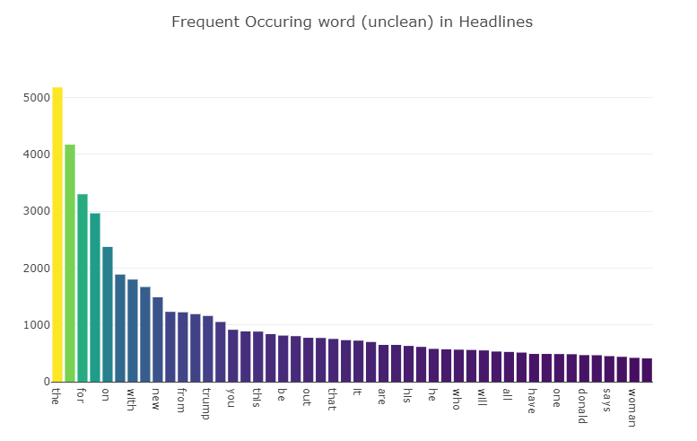
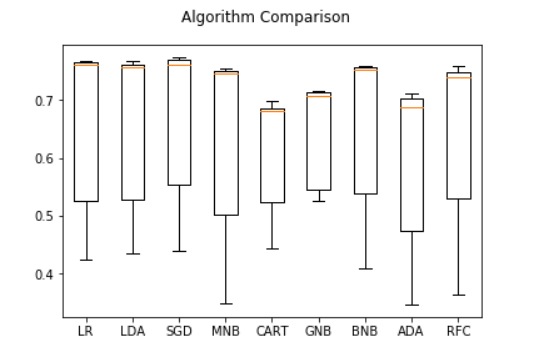
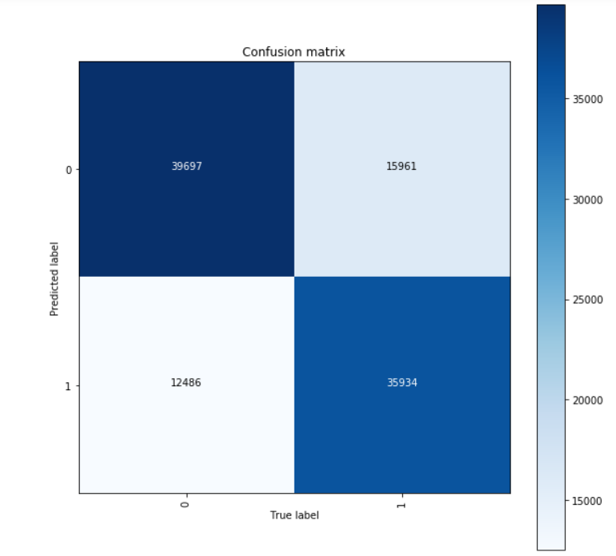
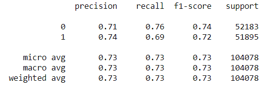

# Sarcasm Detection with Machine Learning Algorithms

One of the key Natural Language Processing problems is sarcasm detection. It has application in various fields that deal with human language. Detecting a sarcastic sentence or phrase can completely twist the general meaning of the sentence or the class
that has been assigned to it. Thus, this approach can be applied to many text datasets before the actual task and the sarcastic data points can be filtered out. Then, the data would have optimistically no outliers in terms of sarcasm. Examples of such can be found here: https://examples.yourdictionary.com/examples-of-sarcasm.html.

## Getting Started

These instructions will get you a copy of the project up and running on your local machine for development and testing purposes. See deployment for notes on how to deploy the project on a live system.

### Prerequisites

What things you need to install the software and how to install them. Run the following commands which will upgrade pip and the 
install the jupyter notebook package.

```
pip3 install --upgrade pip

pip3 install jupyter
```

### Installing

A step by step series of examples that tell you how to get a development env running:

Navigate to the folder contating the Jupyter notebooks (.ipynb files) and run a command prompt (sometimes running as administrator is required). Run the following command:

```
jupyter notebook
```

This will open a browser window that has a file structure as your environment file explorer. You can then navigate to the respective notebooks. In order to run a specific cell press 'Run cell' on the top menu or press 'Run all cells' to run the whole notebook. Results are displayed under each cell.

## Datasets

The data used in this research comes from two Kaggle sources:

### Sarcasm on Reddit

This dataset contains 1.3 million Sarcastic comments from the Internet commentary website Reddit. The dataset was generated by scraping comments from Reddit (not by me :)) containing the \s ( sarcasm) tag. This tag is often used by Redditors to indicate that their comment is in jest and not meant to be taken seriously, and is generally a reliable indicator of sarcastic comment content.

### News Headlines Dataset For Sarcasm Detection

Past studies in Sarcasm Detection mostly make use of Twitter datasets collected using hashtag based supervision but such datasets are noisy in terms of labels and language. Furthermore, many tweets are replies to other tweets and detecting sarcasm in these requires the availability of contextual tweets.

To overcome the limitations related to noise in Twitter datasets, this News Headlines dataset for Sarcasm Detection is collected from two news website. TheOnion aims at producing sarcastic versions of current events and we collected all the headlines from News in Brief and News in Photos categories (which are sarcastic). We collect real (and non-sarcastic) news headlines from HuffPost.



## Testing

The following Machine Learning algorithms were tested on the obtained data: 

* Linear Regression (LR)
* Linear Discriminant Analysis (LDA)
* Stochastic Gradient Decent (SGD)
* Multinomial Naive Bayes (MNB)
* Decision Tree Classifier (CART)
* Gaussian Naive Bayes (GNB)
* Ada Boosting Classifier (ADA)
* Random Forest Classifier (RFC)

## Results

The amount of data is significantly lowered to allow for quick testing using KFold. The test setting uses a TF-IDF vectorizer with (1, 2) ngram range, 1000 max features and min df=2. The proper evaluation metric for this task is accuracy. Results were as following {Name: accuracy (standard deviation}:

* LR: 0.658002 (0.134717)
* LDA: 0.657133 (0.130894)
* SGD: 0.665123 (0.130514)
* MNB: 0.629495 (0.154968)
* CART: 0.611633 (0.095488)
* GNB: 0.642938 (0.085070)
* BNB: 0.648766 (0.136947)
* ADA: 0.595488 (0.132951)
* RFC: 0.642726 (0.137229)

This is a bar plot of the above mentioned results: 



## Final Model

The resulting model from the precious section
is the Logistic Regression. The goal of this
paper is to further improve the default hyperparameters of the current pipeline (model and
transformer), so that the accuracy surpasses the
one obtained from the current best kernal from
Kaggle: https://www.kaggle.com/kashnitsky/
a4-demo-sarcasm-detection-with-logit-solution -
(Accuracy score: 0.7208560551497067).

### Fine-tuning

The follwing parameter values were considered:

* (TF-IDF) max df: np.linspace(0.1, 1, 10)
* (TF-IDF) ngram range: [(1, 1), (1, 2), (1, 3), (2, 3)]
* (TF-IDF) max features: [20000, 50000, 60000, 100000, 250000, 500000]
* (TF-IDF) analyzer: (’word’, ’char’)
* (LR) penalty: (’l1’, ’l2’)
* (LR) C: [0.1, 0.5, 1, 5, 10]
* (LR) max iter: [20, 50, 100]

### Evaluation

After fine-tuning we observed the following 'optimal' parameters:

* (TF-IDF) max df: 0.8
* (TF-IDF) ngram range: (1, 3)
* (TF-IDF) max features: 500000
* (TF-IDF) analyzer: ’word’
* (LR) penalty: ’l2’
* (LR) C: 1
* (LR) max iter: 50

Here is the resulting confusion matrix on the test set:



Here is the classification report for our final model (obtained on the test set):



## Conclusion

This research managed to improve the score of the best Kaggle kernel for ’Sarcasm on Reddit’. However, only SKLearn machine learning algorithm implementations were taken into account. As the Deep Learning research is rising, we suggest that a neural network designed specifically for understanding language would achieve a higher score. This is mainly due to the fact that NNs (or RNNs/CNNs in the case of language) can learn more complex representations which is a crucial advantage when dealing with sarcasm detection. Furthermore, sarcasm-specific word embeddings can contribute a lot to the field. As we saw in the Results section, the meaningful words for sarcasm can be extracted, so it would be a bit more straightforward to generate such an embedding corpus.
